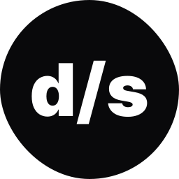

  

<h1 align="center">Application to learn about the App Router in NextJS</h1>

---

## 🎥 Preview

### A little about the project 💻

 

---

## 🚀 I went beyond the challenge

I did more than was requested to me

 

- ✔️ I created a `shirt size chooser` to user chooses which size he wears
- ✔️ I build a `cart interface` to user adds his products into the cart

 

---

## 📚 Learning

All the things that I learned and practiced with this project

- I learned about `Routing` with App Router
- I learned about `Fetching data` with App Router
- I learned how create `a skeleton screen` to the user while loading the data
- I learned how `server components` works
- I learned how add styles with `TailwindCSS`
- I learned how `create tests e2e` with Cypress

**In general, I learned several topics about the App Router in NextJS**

 

---

## 🧪 Technologies

This project was developed using de following technologies:

- [React](https://react.dev/)
- [Typescript](https://www.typescriptlang.org/)
- [Radix](https://www.radix-ui.com/)
- [Lucide React](https://lucide.dev/)
- [NextJS](https://nextjs.org/)
- [TailwindCSS](https://tailwindcss.com/)
- [Zod](https://zod.dev/)
- [Cypress](https://www.cypress.io/)

 

---

## 🔖 Layout

You can view the project layout through the links below:

- [Layout](https://www.figma.com/community/file/1299037596397442545)

Remembering that you need to have a [Figma](http://figma.com/) account to access it.

 

---

Developed by [ricardorhv](https://github.com/ricardorhv) 🖤
